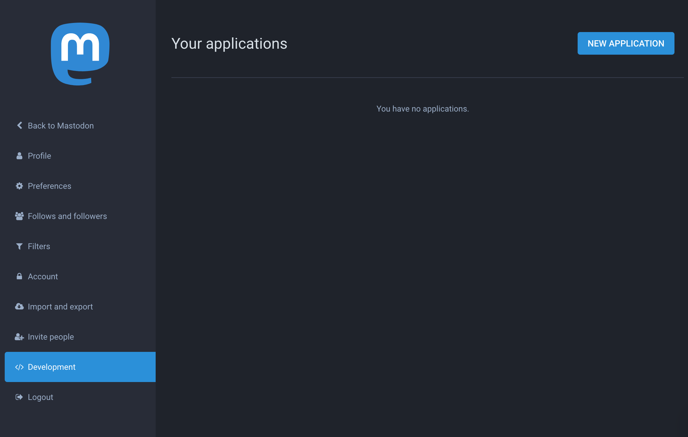
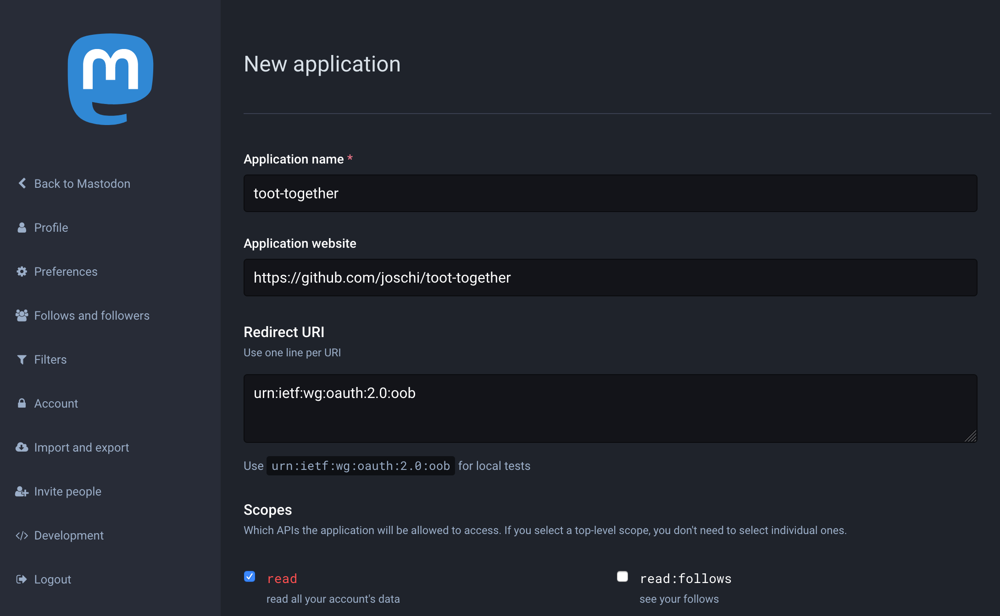
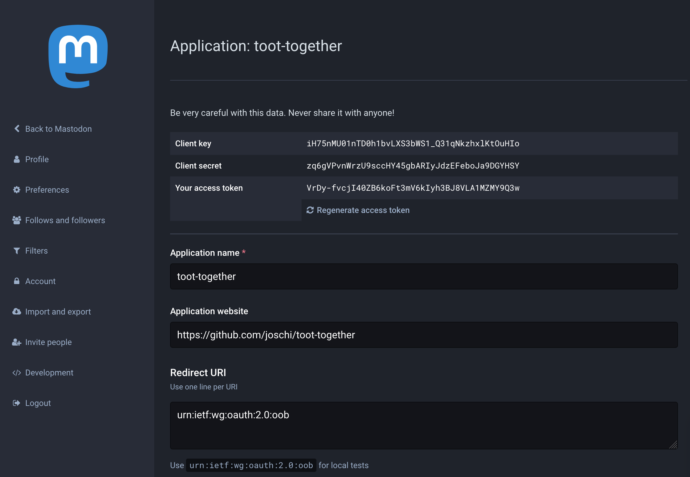
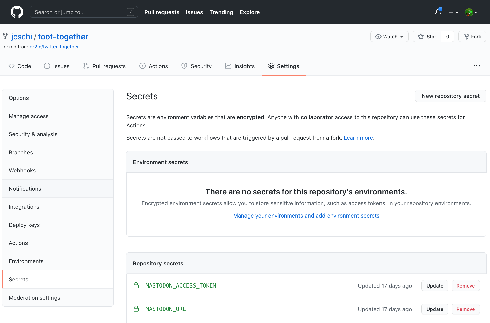

[back to README.md](../README.md/#setup)

# Create a Mastodon app

You can create a Mastodon app for your Mastodon account in your account settings under "Development" -> "Your applications", for example https://mastodon.social/settings/applications/new if your account is hosted on [mastodon.social](https://mastodon.social/).

## Create an app

Only 2 questions are required. Here are my answers for reference.

### Application name (required)

An application name to identify it for your account, for example `toot-together`.

### Application website (optional)

https://github.com/joschi/toot-together

### Scopes

The `toot-together` GitHub Action does only require the `write` scope.

## Save credentials

Open your newly created app in the "Development" tab and copy the string next to "Your access token".

Now save the credentials into your repository’s "Secrets" settings as follows:

| Mastodon Credential name | GitHub Secret name      |
| ------------------------ | ----------------------- |
| Your access token        | `MASTODON_ACCESS_TOKEN` |

---

next: [Create a `.github/workflows/toot-together.yml` file](02-create-toot-together-workflow.md)
